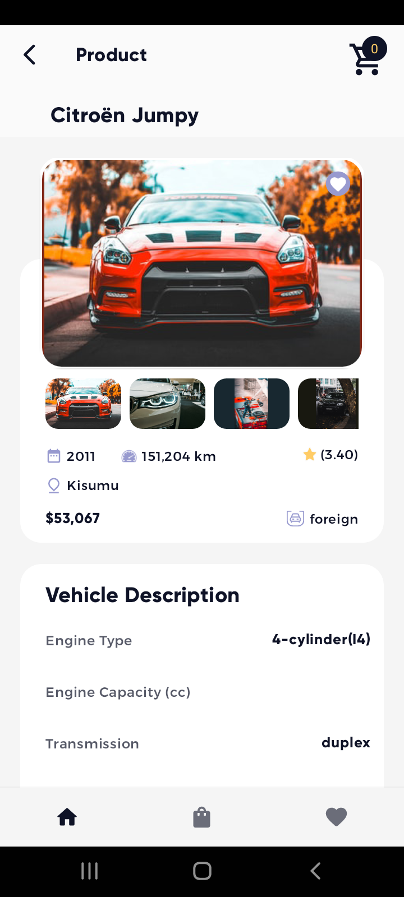

# Autochek Sample App
A sample application that lists popular makes and cars for purchase. This is an overview of the 
technologies and tools that have been used. 

## App Screenshots

## Libraries
Some of the libraries used in this application:

- [ViewModel](https://developer.android.com/topic/libraries/architecture/viewmodel)
- [Koin](https://insert-koin.io/docs/quickstart/android) - A smart Kotlin injection library.
- [Kotlin Coroutines](https://developer.android.com/kotlin/coroutines?gclid =Cj0KCQjwtvqVBhCVARIsAFUxcRtNWP9EQcsHElv7KouLSktFtf83cPJwheSZlj2e8ltftHWcPewxABIaAog0EALw_wcB&gclsrc=aw.ds)
- [Retrofit](https://square.github.io/retrofit/)
- [Coil](https://coil-kt.github.io/coil/getting_started/) - A Kotlin-first image loading library 
  based on Kotlin Coroutines
